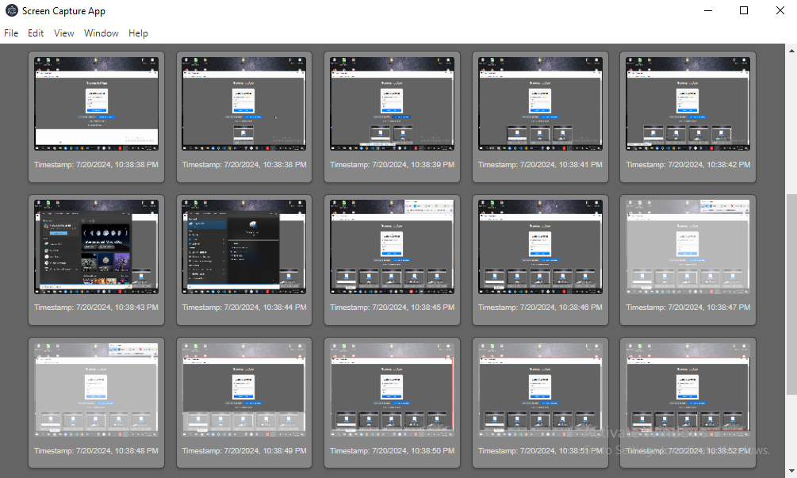

# Screen Capture App

This project is a screen capture application that periodically takes screenshots, stores them using a Node.js and Express backend, and displays them using a React frontend integrated with Electron for desktop applications.




## Table of Contents

- [Screen Capture App](#screen-capture-app)
  - [Table of Contents](#table-of-contents)
  - [Introduction](#introduction)
  - [Features](#features)
  - [Technologies Used](#technologies-used)
  - [Prerequisites](#prerequisites)
  - [Getting Started](#getting-started)
    - [Backend Setup](#backend-setup)
    - [Frontend and Electron Setup](#frontend-and-electron-setup)
  - [Environment Variables](#environment-variables)

## Introduction

The objective of this project is to evaluate the skills of a MERN stack developer through the creation of an application that periodically captures screenshots. The application consists of a backend to store the screenshots, a frontend to display them, and a desktop application to capture and send the screenshots.

## Features

- Periodically capture screenshots
- Store screenshots in MongoDB
- Display screenshots in a React frontend
- Integrated with Electron for desktop functionality
- WebSocket support for real-time updates

## Technologies Used

- MongoDB
- Express.js
- React.js
- Node.js
- Electron
- WebSocket

## Prerequisites

Make sure you have the following installed on your system:

- Node.js
- npm or yarn
- MongoDB

## Getting Started

### Backend Setup

1. Clone the repository:

   ```bash
   git clone https://github.com/yourusername/screen-capture-app.git
   cd screen-capture-app/backend
   ```

2. Install backend dependencies:

   ```bash
   npm install
   ```

3. Create a `.env` file in the `backend` directory and add your MongoDB URI and screenshot limit:

   ```env
   MONGO_URI=mongodb://localhost:27017/screenshotApp
   SCREENSHOT_LIMIT=100
   ```

4. Start the backend server:
   ```bash
   npm start
   ```

### Frontend and Electron Setup

1. Navigate to the `react-with-electron` directory:

   ```bash
   cd ../react-with-electron
   ```

2. Install frontend dependencies:

   ```bash
   npm install
   ```

3. Start the Electron app:
   ```bash
   npm run electron:serve
   ```

## Environment Variables

The `.env` file is used to configure the backend settings. Create a `.env` file in the `backend` directory with the following content:

```env
MONGO_URI=mongodb://localhost:27017/screenshotApp
SCREENSHOT_LIMIT=100
```
